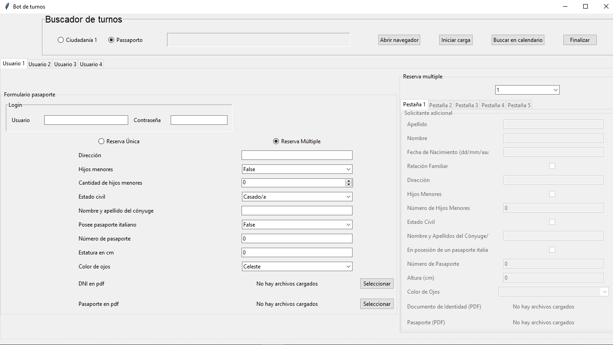

# Automatización 
## Python-Selenium



Este proyecto de automatización fue desarrollado para un cliente de manera freelance, abre una web especifica, hace login, carga los datos segun el tramite indicado y busca un turno libre. Puede hacerse con 4 usuarios a la vez utilizando multi-threading.

Se realizo utilizando: Python, Selenium WebDriver y Tkinter.

### Clonar y Ejecutar Proyecto

Sigue los siguientes pasos para clonar y ejecutar este proyecto en tu entorno local.

### Requisitos previos

1. [Python](https://www.python.org/) - Asegúrate de tener Python instalado, que incluye pip para administrar las dependencias del proyecto.

3. [Git](https://git-scm.com/) - Necesitarás Git para clonar el repositorio.

## Pasos para clonar y ejecutar el proyecto

1. **Clonar el repositorio:**
   Abre tu terminal (o línea de comandos) y ejecuta el siguiente comando para clonar el proyecto desde GitHub:

   ```bash data-copyable
    git clone https://github.com/leandrocarriego/automatizacion_turnos.git

2. **Prepara tu entorno virtual** 
  
   ```python data-copyable
    python -m venv venv
   
3. **Instalar dependencias:**
    
    ```bash data-copyable
   pip install -r requirements.txt


4. **Ejecutar el proyecto:**

    ```bash data-copyable
    python main.py
